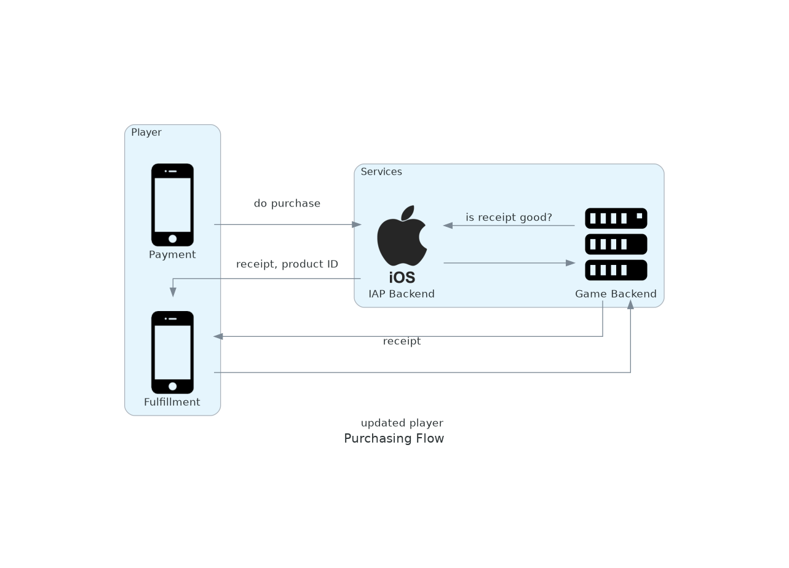

# voodoo-test
Take home test for Voodoo

## Instructions to Run
Developed on node 15.2.1 and npm 6.14.8. Probably will work on other versions, too! But maybe not.

Run tests: `npm test`

Run server: `npm start`

# Assignments

## Assignment A
### Description
The game should be playable offline for most parts, there are some features that will require
internet connection (such as timed limited events, store, etc.).

We would like to secure players’ purchase experience and support them in case of any issues.
As the game would not be multiplayer or social, we would ignore cheating for now.

How would you do that? Please describe your approach/strategy, the steps required,
the tools you would use, etc.

### Answer
A first-party purchasing API- Apple’s or Google’s, depending on the host OS-is required for in-app
purchasing. Apps would be screened from either storefront for using a 3rd party payment provider
when selling digital goods such as in-game content or currency. As such, the player payment flow
would use these tools exclusively. Plugins in most major engines exist for both purchasing backends
and should be used if at all possible, as they will be far more thoroughly vetted by thousands of
consuming developers than something made by a single development team.

The purchasing flow would then have two parts: payment and fulfillment. Payment flows entirely from
the client side using the 1st party API, resulting in a successful payment and a receipt value.
The client would then call the game’s backend with a reference to the claimed receipt. The backend
would need to call the payments backend to verify that the receipt is valid, owned by the user, and
cleared. The receipt itself would additionally store a GUID value that maps to a chunk of game data
that specifies what exactly was purchased. The game backend understands this data will transact it
when the user’s receipt has cleared. Then, the game backend will mark the receipt as transacted-
this data will need to persist at least as long as the receipt validation exists in the 1st party
API. This allows the game to handle crashes- on restarting the app, the client should query the 1st
party API for purchased receipts, then compare them to known transacted receipts. If any receipts
from the 1st party API aren’t referenced as transacted, the player has made a purchase and not
received anything for it, and the game client should retry claiming the receipt in the game backend.



Support from this system has two sides- protecting the game, and protecting the player. Players
obviously need the ability to dispute purchases, be reimbursed, or have a transaction re-run in
event of a bug. Solid logging is useful in an extreme case, but the vast majority of tickets should
be able to be solved by looking at simpler console systems available to non-dev support resources.
Additionally, each of the steps of the above process should be exposed to an admin backend for
manual execution. As a final, more extreme, step, player’s data should be arbitrarily
manipulatable- this is usually useful for dev, too, and I have found that a dev-only admin
environment to make such changes is usually sufficient.

Such systems should also be prepared to meet the other end of support in preventing chargeback
abuse. Chargebacks, which are handled in the 1st party payment system backend rather than the game
backend, need additional handling to prevent players from scamming game goods by requesting refunds
for purchases. Typically, the payment providers act as a decent gatekeeper to some of this behavior
in detecting repeat offenders, but even well-intentioned refunds should also be processed in the
game economy. This can get very tricky, and the exact implementation should be discussed between
engineering and design. As refunds can be processed an arbitrary amount of time after point of
purchase, the digital goods refunded might have since been consumed, or exchanged for other goods
at a favorable discount. There are many ways to handle this: on the simpler end, the value of these
goods in premium currency can be deducted from the player’s balance, or you could simply opt to do
nothing if the good no longer exists. On the more complicated side, you might need to implement a
full economy transaction tracker, which could then be used to backtrack every downstream transaction
of the initial purchase. You’d need to consider this behavior with every aspect of your game
economy, however, which could quickly get unmanageable.

## Assignment B
### Description
We now want to prevent cheating in our game.
* What solution would you implement?
* What are the required changes you would introduce?

### Answer
In this context, I will take cheating to mean illegal modification of saved player data, currently
saved on the client, which would allow that player to gain additional items, power ups, or
progression. Gameplay cheating is usually fairly different and unique to the specific style of
game and it’s networked architecture.

Data coming from the client should not be assumed valid- players can fairly easily use modified
client binaries to arbitrarily modify local data and make requests with content not supported by
the shipped code. As such, sensitive data and routines should be server-authoritative, deployed in
a backend where player actions can be validated against known state. If players need non-networked,
typically read-only access to their data (for example, to display on a UI screen), a local copy of
the data can be kept, but it must be assumed to be overwritten by the copy stored in the backend
database. This syncing behavior must occur any time the player requests an action in the backend
that changes their data.

Naturally, the request usually comes to allow for some local modification of data when the player
does not have an active network connection, as often happens on a mobile device. This can quickly
become a tricky problem, as some actions (purchasing, for example) affect data that necessarily
must be only changed by the server to avoid cheating. A system can be created to tag such data,
allowing for some features that affect only non-sensitive data to be performed locally. However,
in my experience, only a small set of players’ data qualify for local modification, and it’s
typically not the stuff players actually want to be interacting with very often.

A similar system could be developed to what was mentioned to handle chargebacks, where player
actions are modeled with data events that can be queued up locally, then synced when the player has
a network connection. From the player’s perspective, their data would change instantaneously
offline, but in actuality it would only actually be modified when the events could be performed in
the server, then synced back down, overwriting the player’s local modifications. Ideally, if the
player is not cheating, they wouldn’t notice any change. However, this system would add a fair bit
of overhead to feature implementation, as code to transact the data events would need to exist on
both the client and the server, and would have to perform exactly the same operation. Furthermore,
you would have to assume that while the player can’t directly modify their data, they can enque
illegal events, so the validity of each event in sequence would have to be checked.

## Assignment C
### Description
This assignment is to evaluate your technical capacity on concrete realisation.

Given the save json at the end of this document, present a small demonstration API able to
synchronize the json with the game’s one.

* To be coherent with voodoo back end stack, use nodeJS as language
* Describe the game’s requests in the readme of the project, no need to code this part.
* Do only a small demonstration of the solution, no need for a real persistence or complexes parts. The assignment shouldn’t take longer than 4 hours.
* You can add properties to the JSON if you find it necessary
* The currencies can be bought by IAP from the game. For each currency there are 3 values available, 5, 10 and 15. All IAP must be saved and a list of all buys by player/currencies/value available.

### Answer

My code exists in this repo. To run, see instructions at the top. The code implements a highly
simplified version of the design described above. It uses a
[simple, in-memory blobstore](https://github.com/wbjacks/voodoo-test/blob/672a23570b8c136b0d7473362a964da86256ead3/model/user_provider.js#L2-L37)
to hold player state in a server-authoritative manner. The client can send "purchase" objects to the
backend
[at /purchase/validatePurchase](./api/purchase_controller.js) to
[validate the reciept](./service/purchase_validator.js) and
[transact the product](./service/purchase_transactor.js). A purchase
object is a json blob with the following fields:
```javascript
{
    "type": "android|ios",
    "product_id": "number",
    "receipt_id": "string"
}
```

The purchase, once validated, is then [mapped to a corresponding in-game
product](./model/game_data_provider.js), which is then
transacted in the player's data. The player's data is returned in the response to keep the client's
local copy up-to-date with what's in the backend.

See [tests](./test/purchases.js) for request examples.
